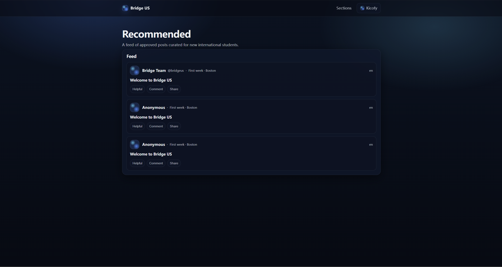

# Bridge US



## What we’re building

**Bridge US** is a community-first platform for international students who are new to the United States.  
It’s designed to replace “mixed-signal” social apps where valuable advice is buried under ads, promotions, and biased recommendations.

We focus on one thing: **helping new international students make safer, smarter decisions faster**—especially in high-stakes areas like housing, transportation, and scam prevention.

## What users can do (social / community features)

Bridge US is not just an information site — it’s a **social, community-driven platform** with user-generated content:

- **Browse a feed** of community posts (only **approved** content is public).
- **Explore by sections** (First week / Housing & move-in / Food & groceries / Transportation / Life admin / Safety & scams).
- **Create an account, log in, and publish posts** (submissions go into a **review queue** first).
- **Language support (EN/中文)** for UI + post language metadata (translation workflow planned).

## The problem

International students arrive with major information gaps:

- **Housing is risky**: fake listings, deposit scams, unsafe neighborhoods, misleading “too good to be true” offers.
- **Advice is noisy**: many platforms mix real experiences with sponsored content, influencer marketing, or paid promotions.
- **Rules vary by location**: what works in one city, campus, or state can be wrong in another.
- **Students feel isolated**: they don’t know who to ask, and they’re not sure who to trust.

The result is unnecessary stress, wasted money, and avoidable harm.

## Our solution

Bridge US combines **real student experiences** with **human-verified reliability**, in a product that’s intentionally designed to be:

- **No disguised sponsored posts**: we prioritize student wellbeing over ad-driven ranking.
- **Experience-based sharing**: real housing experiences, grocery finds, transit tips, survival checklists.
- **Safety-first by default**: scam awareness, verification cues, and privacy-minded community design.
- **Helpful over hype**: content is rewarded for usefulness (not attention).

## Trust & moderation (how we keep it clean)

Bridge US is built around a simple idea: **trust is a product feature**.

- **No disguised sponsored posts**: promotions should not be able to “blend in” as advice.
- **Human review before publishing**: new posts start as `pending_review` and only become public when `approved`.
- **Safety-first**: moderation is where we block scams, privacy leaks, and risky instructions (AI-assisted moderation planned).

## Why AI matters here (and why it’s a big unlock)

AI isn’t a “chatbot feature.” In Bridge US, AI is infrastructure that scales trust and usefulness.

### 1) AI instant Q&A (for students)

Students can ask a question in plain language (English or their native language) and get an answer that is:

- **actionable** (next steps, checklists, warnings),
- **context-aware** (city/campus differences),
- **source-linked** (grounded in verified content as the platform grows).

This reduces the “search across 20 posts and still not sure” problem to a single reliable interaction.

### 2) AI moderation (for safety + quality)

To keep the community clean and trustworthy, AI helps review user submissions by flagging:

- scams and fraud patterns,
- disguised advertising and lead-gen,
- privacy leaks (phone numbers, addresses, IDs),
- harmful or illegal content.

AI accelerates review speed while keeping humans in control for final decisions.

### 3) AI auto-translation (to serve students from every country)

International students don’t all read English fluently—especially under stress.

Bridge US will use AI to automatically translate posts into multiple languages so that:

- high-quality guidance is accessible globally,
- students can contribute in their strongest language,
- communities grow across countries, not just within one language silo.

For high-risk content (housing/scams), translations can be **human-reviewed** to prevent dangerous misunderstandings.

## What makes Bridge US different

- **Trust is a product feature**, not a slogan: content is built for verification and updating.
- **Community-first incentives**: usefulness and clarity beat virality.
- **Zero tolerance for “advice disguised as ads.”**
- **AI + human insight**: fast answers with responsible guardrails.

## Who it’s for

- New international students (first weeks/months in the US)
- International student communities, mentors, and volunteers
- Universities and student support orgs looking to reduce friction, confusion, and harm

## Vision

Bridge US becomes the **default “new-to-the-US operating system”** for international students:

- safer housing decisions,
- fewer scams,
- faster adaptation,
- and a stronger support network—powered by verified community knowledge and AI that scales it responsibly.

## Current repo status (MVP implemented here)

This repository contains a working **Flask + SQLite** MVP with:

- **Auth**: register / login / logout (session-based)
- **UGC posting**: logged-in users can submit posts (stored as `pending_review`)
- **Admin review queue**: admins can approve/reject posts (only approved posts are public)
- **Sections + feed**: homepage shows latest approved posts; section pages show approved posts
- **Basic i18n hooks**: EN/中文 language switch via session

## Run locally (Windows PowerShell)

```powershell
.\setup.ps1
.\run.ps1
```

Then open `http://127.0.0.1:5000`.

## Docs (product + architecture)

See `docs/` (English + Chinese) for the product plan, trust/governance, AI + human verification, and the long-term technical architecture.

